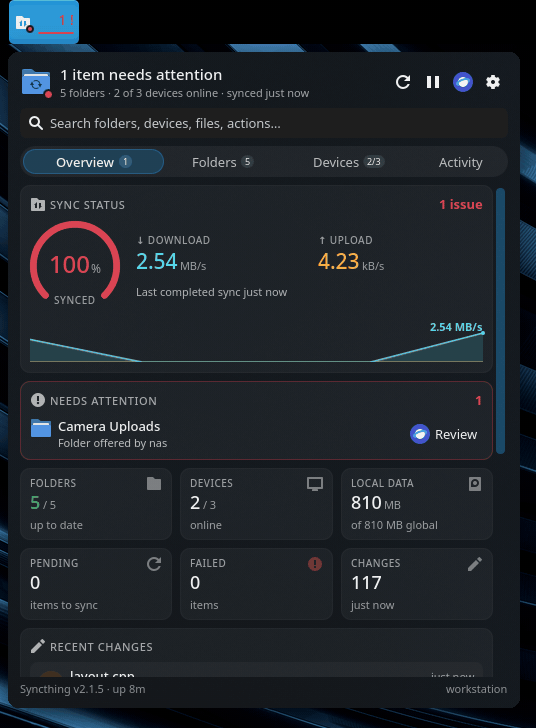

# Linux Syncthing Monitor

Linux Syncthing Monitor is a Plasma 6 widget for checking and controlling a
local Syncthing instance without keeping the web interface open. In a panel it
is a fixed-width button with a dropdown dashboard; on the desktop it shows the
full dashboard directly.

The panel icon has a small status dot: green when every folder is up to date,
yellow while synchronization is pending or running, and red when Syncthing is
unavailable or something needs attention. Next to the icon the button shows the
overall sync progress (or the number of items needing attention), the live
transfer rates, or nothing, as configured.

<p align="center"></p>

## Features

- Searchable dashboard with Overview, Folders, Devices and Activity tabs;
  matches are highlighted and Enter opens the first result
- Overall sync ring, transfer rates with a history graph, folder, device,
  local data, pending, failed and recent-change tiles
- Consolidated attention inbox for folder failures, Syncthing errors, and new
  device or folder invitations
- Expandable folder cards with progress, paths, IDs, modes, sizes, peers,
  watcher and rescan settings, recent changes, sync queue, and failed items
- Per-folder open, rescan, pause, resume, copy path and copy ID actions, with
  All / Syncing / Errors / Paused filters
- Remote-device cards with connection state, live per-device rates, completion,
  address, version, encryption, transfer totals, last seen, previous connection
  duration, shared folders and device ID
- Pause, resume and copy-ID actions for remote devices, with All / Online /
  Offline / Paused filters
- Activity feed of local and remote file changes and device connections from
  Syncthing's event streams; click a change to open its folder
- Guarded pause-all control and one-click resume-all
- Configurable offline-device grace period with overdue status indication
- Optional Plasma notifications for completed syncs, errors, invitations, and
  overdue devices
- Persisted last-successful-sync time
- One-click access to the Syncthing web interface
- Event-driven updates; transfer rates are only sampled while the dashboard is
  visible or the panel is set to show rates
- Automatic discovery of the local Syncthing address and API key

## Requirements

- Plasma 6
- Syncthing running as the current user

The automatic connection supports Syncthing configurations in the standard
state, config, and data directories. A remote or nonstandard instance can be
configured from the widget's **Connection** settings.

The default offline warning grace period is 24 hours. Set it to zero to keep
offline devices informational indefinitely. Notification categories can be
enabled or disabled independently in the same settings page.

## Install

```bash
git clone --recurse-submodules https://github.com/DevL0rd/Syncthing-Monitor.git
cd Syncthing-Monitor
./install.sh
```

Then open Plasma's **Add Widgets** menu and add **Syncthing Monitor** to a
panel or the desktop. The installer enables the Qt permission needed to discover Syncthing's
local configuration and always restarts Plasma through its managed user service
as the final installation step. This permission applies to Plasma's QML process
and is retained when the widget is uninstalled because other widgets may also
rely on it.
Middle-clicking the panel icon requests a rescan of every folder.

## Uninstall

```bash
./uninstall.sh
```

Removing the widget does not modify Syncthing or its configuration.

## License

Linux Syncthing Monitor is released under the GPL-3.0-or-later license.

## Updates

On pacman-based systems, `./install.sh` registers the git checkout with system updates. Every `pacman -Syu` fetches the checkout and, when upstream has new commits and your checkout has no local changes or commits of its own, fast-forwards it and reinstalls without restarting Plasma. You get a notification when an update is installed. If no desktop session is running during the update, the rest of the install finishes at your next login. Other distributions don't get this hook; run `git pull && ./install.sh` yourself.

Packages (for example from the AUR) pass `--aur` or set `SYNCTHING_MONITOR_AUR=true` so the package manager handles updates instead, and no hook is registered. `./uninstall.sh` removes the hook.
