<a id="top"></a>

<p align="center">
  <picture>
    <source media="(prefers-color-scheme: dark)" srcset="docs/media/banner-dark.svg">
    <source media="(prefers-color-scheme: light)" srcset="docs/media/banner-light.svg">
    
  </picture>
</p>

<p align="center">
  
  
  <a href="LICENSE"></a>
  <a href="https://github.com/DevL0rd/Syncthing-Monitor/stargazers"></a>
</p>

<h3 align="center">Your sync, at a glance.</h3>

<p align="center">
  Syncthing Monitor puts every folder, device and file change one click away in your Plasma panel.<br>
  See what's syncing, fix what isn't and pause what you need to, without keeping the web interface open.
</p>

<p align="center">
  <a href="#get-started"><b>Get started</b></a> ·
  <a href="#see-it-work"><b>See it work</b></a> ·
  <a href="#settings"><b>Settings</b></a> ·
  <a href="#faq"><b>FAQ</b></a> ·
  <a href="#more"><b>More projects</b></a>
</p>

<p align="center">
  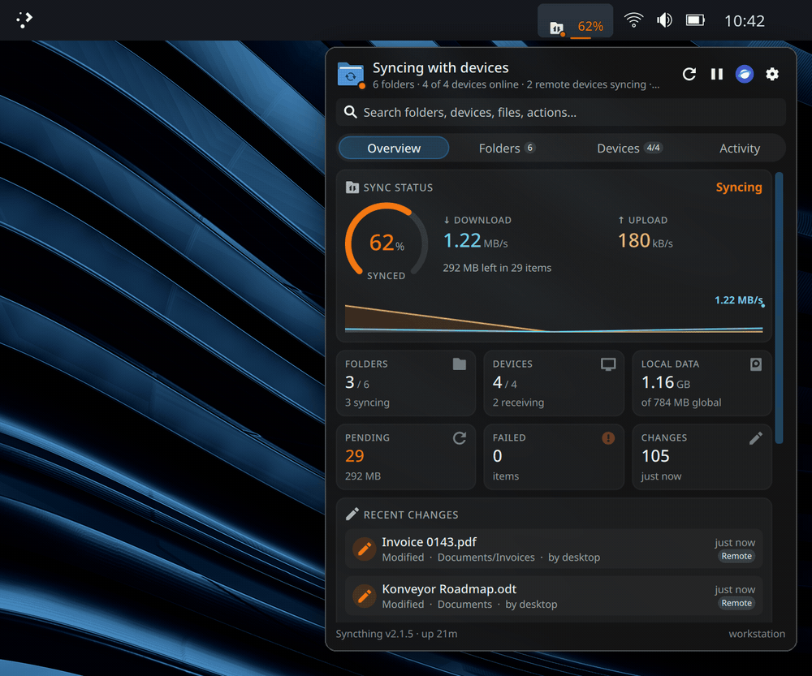
</p>

---

<a id="get-started"></a>

## 🚀 Get started

```sh
git clone --recurse-submodules https://github.com/DevL0rd/Syncthing-Monitor.git
cd Syncthing-Monitor
./install.sh
```

The installer adds the widget and restarts Plasma. Open **Add Widgets**, drop **Syncthing Monitor** on a panel or the desktop, and it finds your Syncthing by itself.

> [!TIP]
> Middle-click the panel button to rescan every folder at once.

<table>
  <tr>
    <td>🔄 <b>Update</b></td>
    <td>On Arch-based systems Syncthing Monitor updates itself with every system update and lets you know when it did. Anywhere else, run <code>git pull &amp;&amp; ./install.sh</code>.</td>
  </tr>
  <tr>
    <td>📦 <b>From a package</b></td>
    <td>Package builds run <code>./install.sh --aur</code>, so your package manager handles updates instead.</td>
  </tr>
  <tr>
    <td>🧹 <b>Remove</b></td>
    <td>Run <code>./uninstall.sh</code>. Syncthing and its configuration are never touched.</td>
  </tr>
  <tr>
    <td>🖥️ <b>Needs</b></td>
    <td>KDE Plasma 6 and Syncthing running as your user. A remote or custom Syncthing works too, from the widget's settings.</td>
  </tr>
</table>

---

<a id="see-it-work"></a>

## 🎬 See it work

### 📍 Right in your panel

The panel button is a small, steady readout of your sync. The dot on the icon turns green when every folder is up to date, orange while anything is syncing and red when something needs you. Next to it you can show the overall progress, live transfer rates over a faint rate graph, or nothing at all.

<p align="center">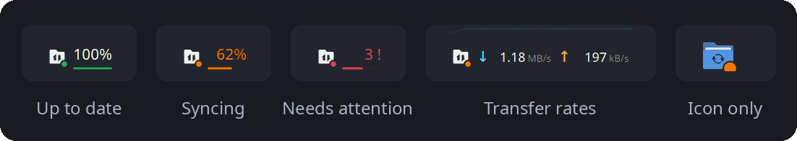</p>

### 📊 Everything on one page

<table>
  <tr>
    <td width="46%" valign="top">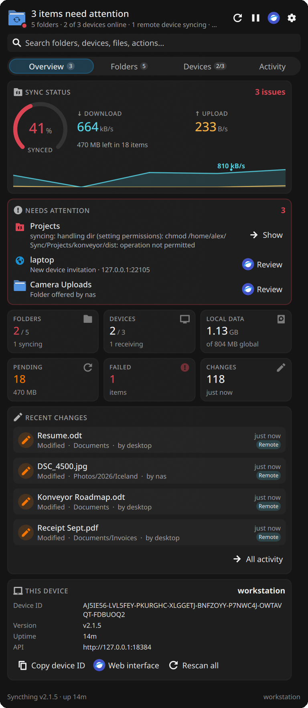</td>
    <td valign="top">
      <br>
      <b>Overview</b> answers "is everything synced?" before you finish asking.
      <br><br>
      🟠 <b>Sync ring</b> with what's left to transfer, and when the last sync finished<br><br>
      📈 <b>Download and upload</b> speeds with a live history graph<br><br>
      🚨 <b>Needs attention</b> gathers failed files, Syncthing errors and new device or folder invitations in one inbox. <b>Show</b> jumps to the folder, <b>Review</b> opens the invitation in Syncthing<br><br>
      🧮 <b>Tiles</b> for folders, devices, local data, pending, failed and recent changes<br><br>
      📝 <b>Recent changes</b> across every folder, and <b>this device</b> with its ID one click from your clipboard
    </td>
  </tr>
</table>

### 📁 Folders you can dig into

Every folder shows its state, size and progress at a glance. Open one to see where it lives, how it syncs, who it's shared with and what changed last, with **Open**, **Rescan**, **Pause**, **Copy path** and **Copy ID** right there. Filter by **Syncing**, **Errors** or **Paused** when the list gets long.

<table>
  <tr>
    <td width="50%" valign="top">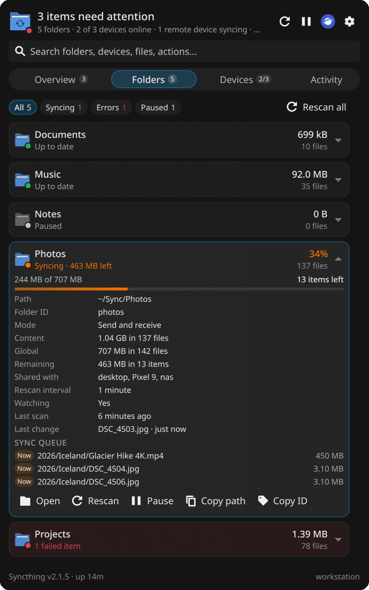<p align="center"><b>Sync queue</b> — what's transferring now and what's next</p></td>
    <td width="50%" valign="top">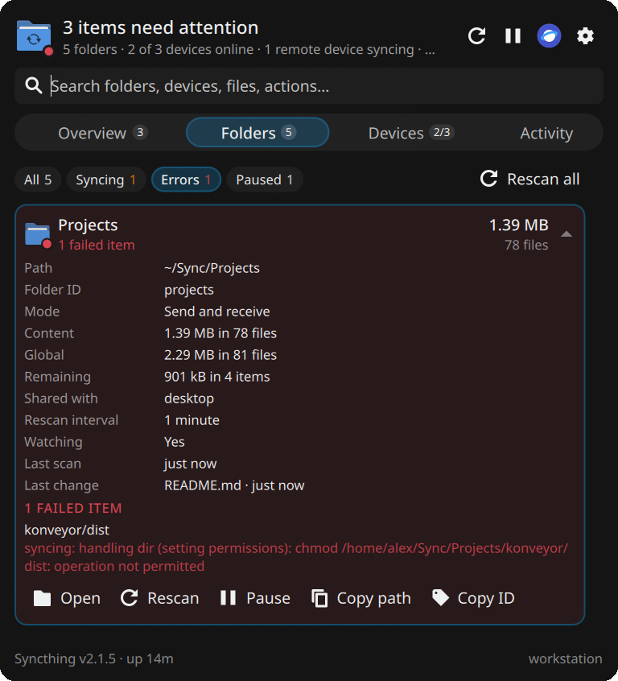<p align="center"><b>Failed items</b> — which file failed, and why</p></td>
  </tr>
</table>

### 💻 Every device, live

<table>
  <tr>
    <td width="46%" valign="top">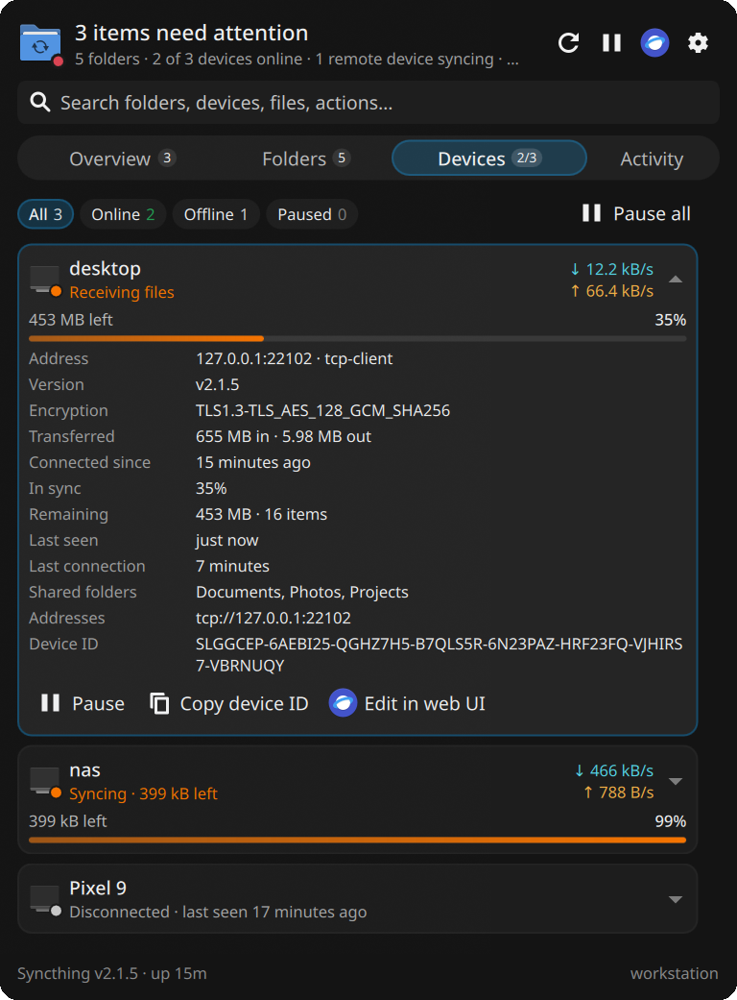</td>
    <td valign="top">
      <br>
      See which devices are online, what each one is sending and receiving right now and how far it has to go.
      <br><br>
      Open a device for its address, Syncthing version, encryption, total transfer, when it connected, when it was last seen, how long the last connection lasted and the folders you share with it.
      <br><br>
      Pause or resume a device, copy its ID, or edit it in the web interface. A device that stays offline past your warning time turns amber, so a phone that stopped syncing a week ago doesn't go unnoticed.
    </td>
  </tr>
</table>

### 📰 Activity as it happens

<table>
  <tr>
    <td valign="top">
      <br>
      A running feed of files added, changed and deleted, on this computer and on your other devices, plus devices connecting and dropping off.
      <br><br>
      Each change shows the folder, who made it and when. Filter to <b>From devices</b>, <b>Local</b> or <b>Connections</b>, and click a change to open the folder it happened in.
    </td>
    <td width="46%" valign="top">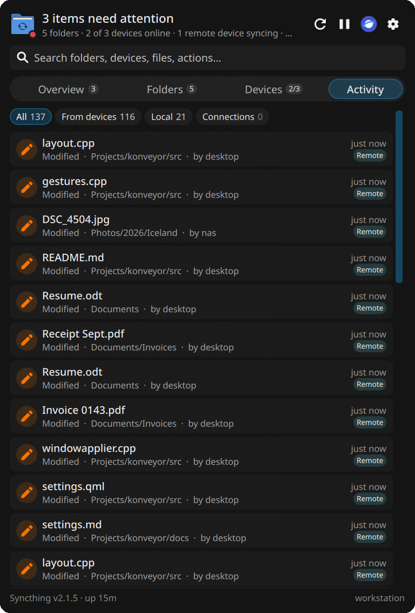</td>
  </tr>
</table>

### 🔎 Search everything

<table>
  <tr>
    <td width="46%" valign="top">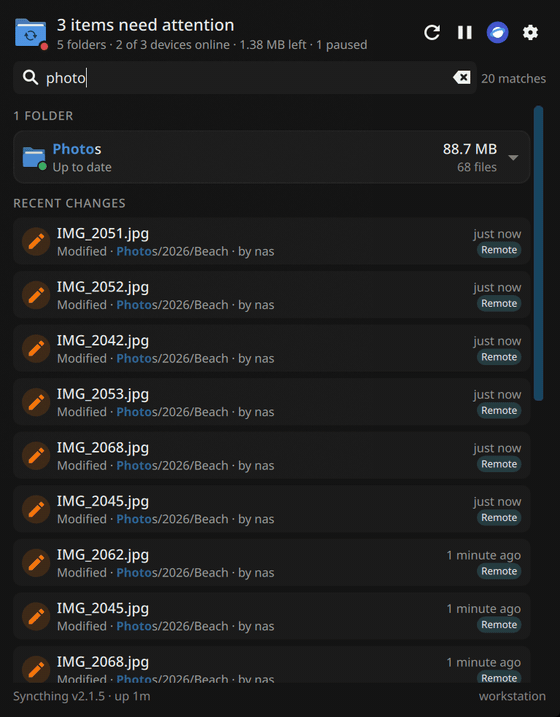</td>
    <td valign="top">
      <br>
      Start typing the moment the dashboard opens. Search finds folders by name, path or ID, devices by name, ID or address, and any file that changed recently, with every match highlighted.
      <br><br>
      It finds actions too. Type <b>pause</b>, <b>rescan</b>, <b>web</b> or <b>copy id</b> and run it from the results, or press <kbd>Enter</kbd> for the first match.
    </td>
  </tr>
</table>

### 🖼️ On the desktop too

<table>
  <tr>
    <td width="50%" valign="top">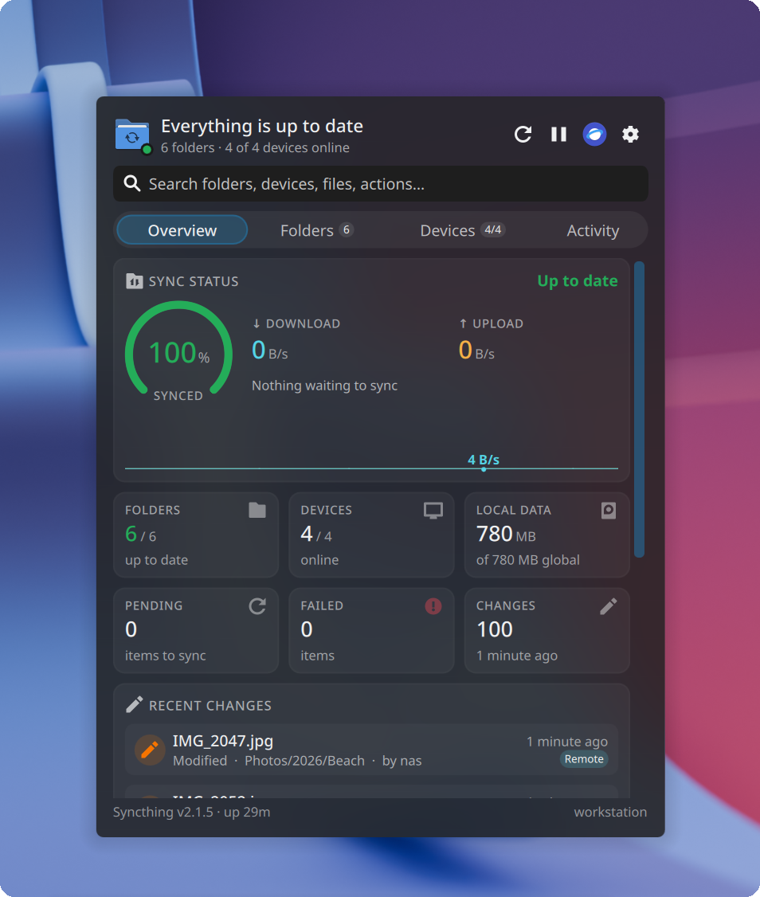</td>
    <td valign="top">
      <br>
      Put Syncthing Monitor on the desktop and the whole dashboard sits right there, no clicking required.
      <br><br>
      Everything works the same as in the panel: tabs, search, folder and device actions and the header buttons to rescan, pause every device, open the web interface or change settings.
    </td>
  </tr>
</table>

### ✨ And the little things

<table>
  <tr>
    <td width="33%" valign="top">
      <h4>🔔 Notifications</h4>
      Hear about finished syncs, errors and new invitations, or a device that has been offline too long. Repeated errors don't flood you.
    </td>
    <td width="33%" valign="top">
      <h4>🧭 Finds Syncthing itself</h4>
      Reads the address and API key from your local Syncthing, so there's nothing to set up.
    </td>
    <td width="33%" valign="top">
      <h4>🪶 Light on your system</h4>
      Updates come from Syncthing's event stream. Transfer rates are only read while the dashboard is open or the panel shows them.
    </td>
  </tr>
  <tr>
    <td valign="top">
      <h4>⏸️ Safe pause all</h4>
      Pausing every device takes a second click, so a stray tap never stops your sync. Resuming is one click.
    </td>
    <td valign="top">
      <h4>🌐 One click to Syncthing</h4>
      The full web interface is always a button away, in the header and in the widget's right-click menu.
    </td>
    <td valign="top">
      <h4>🕒 Remembers where you were</h4>
      Reopens on the tab you left and keeps the time of your last completed sync across restarts.
    </td>
  </tr>
</table>

<p align="right"><a href="#top">back to top ⬆</a></p>

---

<a id="settings"></a>

## 🎛️ Settings

Right-click the widget and choose **Configure Syncthing Monitor**, or hit the gear in the dashboard's header.

<table>
  <tr>
    <td width="50%" valign="top">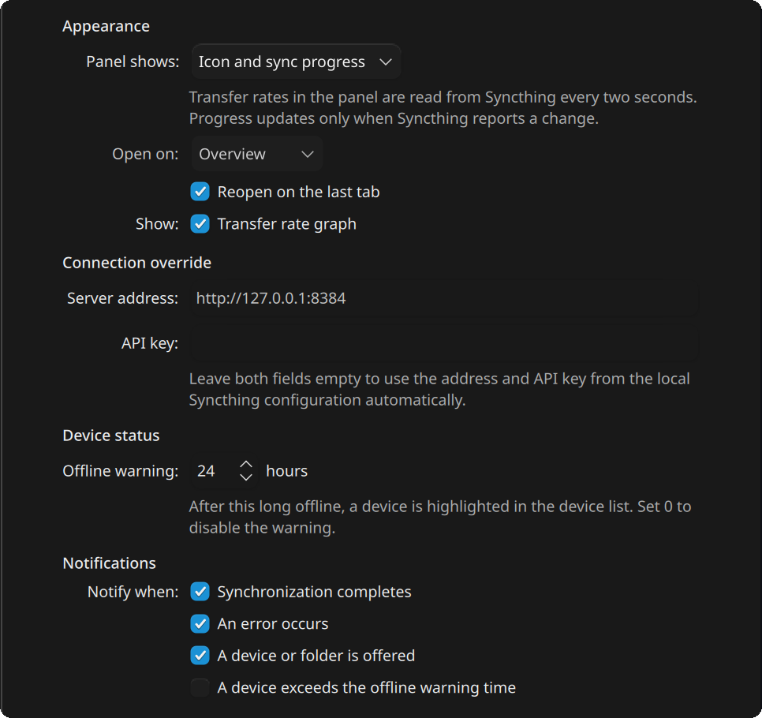</td>
    <td valign="top">
      <br>
      🎨 <b>Appearance</b> — what the panel button shows, which tab the dashboard opens on, and the transfer rate graph
      <br><br>
      🔌 <b>Connection override</b> — point the widget at another Syncthing with its address and API key. Leave both empty to use your local Syncthing
      <br><br>
      📡 <b>Device status</b> — how many hours a device can be offline before it needs attention, from 0 (never) to 30 days. The default is 24 hours
      <br><br>
      🔔 <b>Notifications</b> — pick which events notify you: finished syncs, errors, invitations and overdue devices
    </td>
  </tr>
</table>

---

<a id="faq"></a>

## 💬 Questions

<details>
<summary><b>Does it change my Syncthing setup?</b></summary>
<br>
Only when you ask it to. Pausing or resuming a folder or device and rescanning go through Syncthing's own API, exactly like the web interface. Installing or removing the widget never touches Syncthing or its configuration.
</details>

<details>
<summary><b>Can I monitor Syncthing on another computer?</b></summary>
<br>
Yes. Enter its address and API key under <b>Connection override</b> in the settings.
</details>

<details>
<summary><b>It says "Syncthing was not found". What now?</b></summary>
<br>
The widget looks for Syncthing's configuration in the standard locations under your home folder. If yours lives somewhere else, or Syncthing runs as a different user, set the address and API key in the settings. The API key is under <b>Actions → Settings → General</b> in the Syncthing web interface.
</details>

<details>
<summary><b>Why does the installer restart Plasma?</b></summary>
<br>
Plasma only lets widgets read local files, like Syncthing's configuration, when it starts with that permission turned on. The installer turns it on and restarts Plasma so it takes effect. The permission stays when you uninstall, because other widgets may rely on it.
</details>

<details>
<summary><b>Does it slow my system down?</b></summary>
<br>
No. The widget listens to Syncthing's event stream instead of asking for everything over and over. Transfer rates are read every two seconds, and only while you can see them.
</details>

---

<a id="more"></a>

## 🧰 More from DevL0rd

Other Plasma projects made to sit on the same desktop. Click a banner to open it on GitHub.

<p align="center">
  <a href="https://github.com/DevL0rd/Konveyor">
    <picture>
      <source media="(prefers-color-scheme: dark)" srcset="docs/media/more/konveyor-dark.svg">
      <source media="(prefers-color-scheme: light)" srcset="docs/media/more/konveyor-light.svg">
      
    </picture>
  </a>
  <br>
  <a href="https://github.com/DevL0rd/Konveyor"><b>Konveyor</b></a> · Your windows, on a conveyor belt.
</p>

<p align="center">
  <a href="https://github.com/DevL0rd/RVC-Voice-Changer">
    <picture>
      <source media="(prefers-color-scheme: dark)" srcset="docs/media/more/rvc-voice-changer-dark.svg">
      <source media="(prefers-color-scheme: light)" srcset="docs/media/more/rvc-voice-changer-light.svg">
      
    </picture>
  </a>
  <br>
  <a href="https://github.com/DevL0rd/RVC-Voice-Changer"><b>RVC Voice Changer</b></a> · Sound like anyone, in every app.
</p>

<p align="center">
  <a href="https://github.com/DevL0rd/KBoard">
    <picture>
      <source media="(prefers-color-scheme: dark)" srcset="docs/media/more/kboard-dark.svg">
      <source media="(prefers-color-scheme: light)" srcset="docs/media/more/kboard-light.svg">
      
    </picture>
  </a>
  <br>
  <a href="https://github.com/DevL0rd/KBoard"><b>KBoard</b></a> · Type, glide and talk, right on your desktop.
</p>

<p align="center">
  <a href="https://github.com/DevL0rd/Android-Daemon">
    <picture>
      <source media="(prefers-color-scheme: dark)" srcset="docs/media/more/android-daemon-dark.svg">
      <source media="(prefers-color-scheme: light)" srcset="docs/media/more/android-daemon-light.svg">
      
    </picture>
  </a>
  <br>
  <a href="https://github.com/DevL0rd/Android-Daemon"><b>Android-Daemon</b></a> · Your phone, right on your desktop.
</p>

---

<p align="center">
  Syncthing Monitor is an independent project and is not affiliated with the Syncthing Foundation or KDE.<br>
  Released under the <a href="LICENSE">GPL-3.0-or-later</a>.
</p>

<p align="center"><a href="#top">back to top ⬆</a></p>
